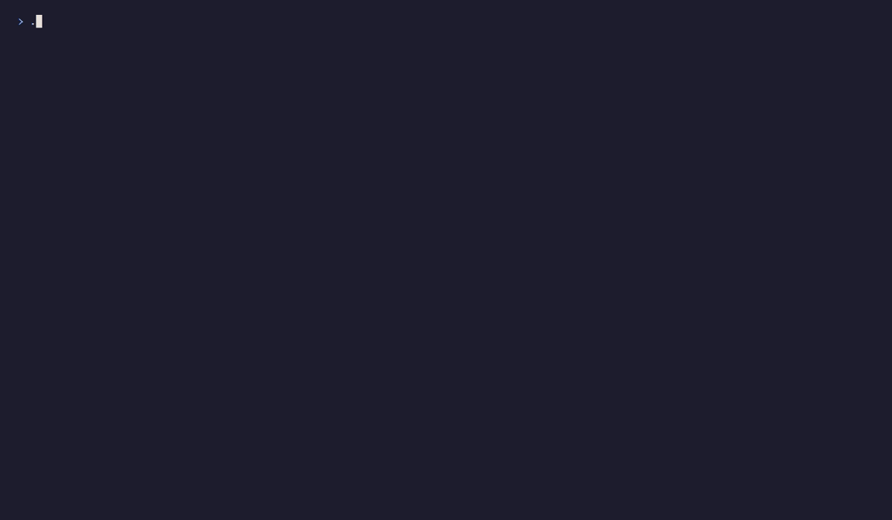
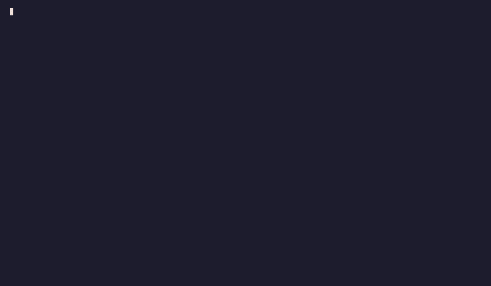

# Examples

One small program per package, each with a recording of it running. Every GIF is a real session of the program beside it: the keystrokes are in the `.tape` next to it, and re-recording them is how they stay true. Run any of them with `go run ./examples/<name>`.

For everything at once, see [`examples/demo`](examples/demo/main.go).

## shell

The struct an app embeds. Two tabs and two panes; `s` sets a status that clears itself, `b` shows the busy spinner until the work is done, `tab` switches tab and `?` lists every key.

<details>
<summary>Show Example</summary>


</details>

[`examples/shell/main.go`](examples/shell/main.go)

## layout

A header over two columns. `w` narrows the window below the `Collapse` limit and the side column drops out, then brings it back. Each pane prints the rect it was given.

<details>
<summary>Show Example</summary>


</details>

[`examples/layout/main.go`](examples/layout/main.go)

## draw

The helpers the frame is drawn with, one section each: header, tabs, breadcrumb, a divider bare and labelled, a card with its actions in the footer, a focused and an unfocused button, key-value rows, wrapped and truncated text, numbered lines, and the empty state.

<details>
<summary>Show Example</summary>


</details>

[`examples/draw/main.go`](examples/draw/main.go)

## icon

Every state mark in both sets, side by side, then a list of packages and a source chain drawn as a tree with the set in use. `a` swaps both between Unicode and ASCII, the set `BEZEL_ASCII` or `TERM=dumb` picks on its own.

<details>
<summary>Show Example</summary>


</details>

[`examples/icon/main.go`](examples/icon/main.go)

## form

One of each control in a form: a name typed into an `Input`, an image picked from a `Select` that opens under it, a `Radio`, a `Toggle` and a `Checkbox`, then the `Button` that submits. tab and shift+tab move between them, and every value starts in one column. Create reports what the form holds on the status row.

<details>
<summary>Show Example</summary>


</details>

[`examples/form/main.go`](examples/form/main.go)

## progress

A count that fills on its own, as a `Line` (label, bar, `done/total`) and as a bare `Bar`, and a wizard's stages in a `Stepper`. `n` and `p` walk the stages; the copy drawn at 30 columns folds to "Step 2 of 4". `r` restarts the count.

<details>
<summary>Show Example</summary>



</details>

[`examples/progress/main.go`](examples/progress/main.go)

## theme

Every colour role and a list drawn with it, stepped through a few presets with `n` and `p`. `SetTheme` swaps them on a running shell.

<details>
<summary>Show Example</summary>


</details>

[`examples/theme/main.go`](examples/theme/main.go)

## themebrowser

The table a `--list-themes` flag prints: scrollable in a terminal, plain lines in a pipe.

<details>
<summary>Show Example</summary>


</details>

[`examples/themebrowser/main.go`](examples/themebrowser/main.go)

## overlay

The ready-made modals. An alert any key closes, a confirm that answers the app, a prompt that refuses an empty name, the help list, and a pager over a command's output, scrolled line by line, a page at a time and to the end. `esc` closes each one.

<details>
<summary>Show Example</summary>


</details>

[`examples/overlay/main.go`](examples/overlay/main.go)

## legend

More keys than one row holds: the ones cut are counted, and `?` lists them all. Five keys need a write capability; `w` grants it, and they join the legend and the count.

<details>
<summary>Show Example</summary>



</details>

[`examples/legend/main.go`](examples/legend/main.go)

## palette

The `:` command line. A name completes with `tab`, a command takes an argument, and one that is unknown or not allowed says so on the status row.

<details>
<summary>Show Example</summary>


</details>

[`examples/palette/main.go`](examples/palette/main.go)

## list

Rows under section headings the cursor skips, a `/` filter that takes every key (`q` included), and `enter` showing the payload the row carries.

<details>
<summary>Show Example</summary>


</details>

[`examples/list/main.go`](examples/list/main.go)

## tree

A directory tree over the app's own node type. The arrows expand and collapse; `:reveal` opens every parent on the way down to a path.

<details>
<summary>Show Example</summary>


</details>

[`examples/tree/main.go`](examples/tree/main.go)

## table

Columns sized to their contents. `w` narrows the window: the description gives way first, and the version and licence stay whole.

<details>
<summary>Show Example</summary>


</details>

[`examples/table/main.go`](examples/table/main.go)

## textbox

A multi-line value with its lines numbered. Every key is text, so the app quits on `esc`; `ctrl+s` counts the lines.

<details>
<summary>Show Example</summary>


</details>

[`examples/textbox/main.go`](examples/textbox/main.go)

## browser

Recipe names on the left, the selected recipe on the right. `tab` moves the keys to the recipe so it scrolls, and back.

<details>
<summary>Show Example</summary>


</details>

[`examples/browser/main.go`](examples/browser/main.go)

## animation

A hints pane that slides open and shut on `h`: a tween eases its height and the layout follows it frame by frame.

<details>
<summary>Show Example</summary>


</details>

[`examples/animation/main.go`](examples/animation/main.go)

## inline

For a CLI that prints logs: one question below them, then a progress bar redrawn in place. Nothing takes over the screen.

<details>
<summary>Show Example</summary>


</details>

[`examples/inline/main.go`](examples/inline/main.go)

## bezeltest

No recording: this one is a test. A counter, and the test that drives it with the key presses a terminal would send.

[`examples/bezeltest/main_test.go`](examples/bezeltest/main_test.go)

## Recording

The tapes are written for Windows: each sets `Set Shell "powershell"` and builds a `.exe`. With [VHS](https://github.com/charmbracelet/vhs), `ttyd` and `ffmpeg` on the `PATH`, from the repository root:

```sh
vhs examples/list/list.tape
```

From the root, always: `Output` resolves against the working directory, not against the tape. Each tape builds its program off camera and deletes the binary when it is done.
