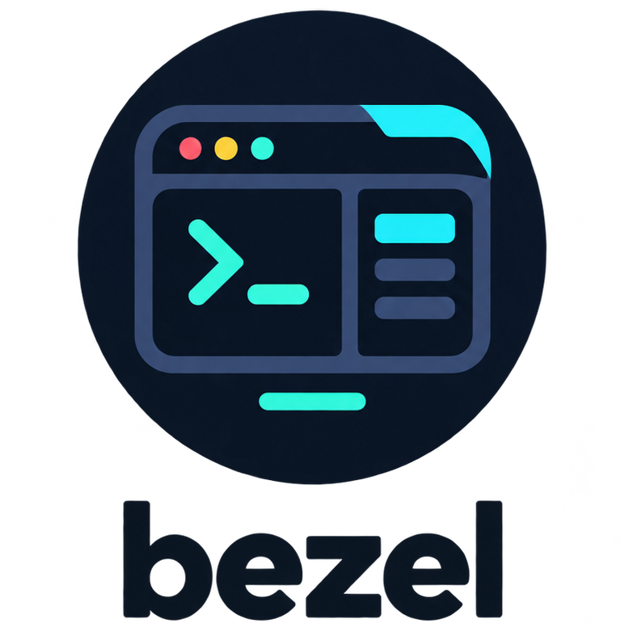

<p align="center">
  
</p>

The frame around a [Bubble Tea](https://github.com/charmbracelet/bubbletea) v2 app: layout, panels, theme, overlays, and a shell that owns resize, tabs, focus, status and the key legend, so the app only draws what goes *inside* the panes.

```sh
go get github.com/lucasassuncao/bezel
```

## Packages

| Package | What it is |
| --- | --- |
| `layout` | Pure. Declare the screen as a tree (`Columns`, `Rows`, `Fixed`, `Fill`) and resolve it to rects. `Collapse` drops a leaf below a width; `Info()` marks a pane that only informs, which tab skips. |
| `draw` | Pure. ANSI-safe truncate/fit/wrap, titled panels, header, tabs, status line, `Composite` for floating boxes. |
| `shell` | The struct you embed. Handles `WindowSizeMsg`, tabs, focus, status with TTL, a busy spinner (`Busy`/`Idle`), `Copy` to the clipboard off the event loop, overlays and the legend. Keys are `Action`s: prebuilt ones with a fixed meaning (`Help`, `Commands`, `ChangeTab`, `ChangePane`, `Move`, `Scroll`, `Quit`) and `Custom` ones; one declaration drives the legend, the key and the palette. `DisplayOnly` prints a key a component handles itself; `RunWith` gives a prebuilt the app's own behavior. `ChangePane` sends a `FocusMsg{From, To}` so the app can run what entering and leaving a pane mean. |
| `theme` | Semantic palette (Accent, Success, Danger, ...), presets, and the lipgloss styles every panel, legend and modal draws with. Empty roles follow the terminal's light or dark background: `Resolve(t, dark)`. |
| `themebrowser` | Inline table of every preset, for a `--list-themes` flag. |
| `overlay` | Stack of modals. The top one gets the keys, `Esc` pops it. Ready-made `Alert`, `Confirm`, `Help`, and `Prompt` for one line of typed text (a required text, a validation, a live preview). |
| `legend` | Key entries tagged with a capability, filtered by what the session allows, packed into a few rows. |
| `palette` | The `:` command line `shell.Commands()` opens: prefix matching, exact name before unique prefix, arrows, tab completion, arguments. |
| `list` | Cursor list with section headings, `↓ N more`, and a `/` filter. Rows carry your payload. |
| `tree` | Flat depth-first tree: visibility under collapsed parents, cursor over headings, expand/collapse, `Reveal`. Generic over your node type. |
| `table` | Sizes columns to their contents within a width (`Fit`) and lays out header and rows. |
| `textbox` | The bubbles text area for a multi-line value: no length or line cap, the numbered gutter, theme colours, `SetText` folding CRLF. Height stays yours. |
| `browser` | Pick-from-a-list screen: labels left, the selected item's detail right, tab to switch. |
| `animation` | Eased integer tween for panels that slide open. |
| `inline` | For CLIs that print logs: `Confirm` asks yes/no below the current line, `Bar` draws a progress bar. Nothing takes the screen. |
| `bezeltest` | For tests: `Key("ctrl+s")` is the key press a terminal sends, `Text` included for a plain character, and it reads back as the name it was given. |

## Shape of an app

```go
sh := shell.New(shell.Config{
    Layout: layout.Columns(
        layout.Fixed("list", layout.Ratio(1, 3), layout.Min(26), layout.Max(52)),
        layout.Fill("detail"),
    ).Collapse(72, "detail"),
    Tabs:    tabs, // each implements shell.Tab: Name(), Status(ctx) and Actions(ctx)
    Theme:   theme.Resolve(theme.ThemeMint, true), // re-resolve on tea.BackgroundColorMsg
    Title:   "my app",
    Actions: []shell.Action{shell.Help(), shell.ChangeTab(), shell.Move(), shell.Quit()},
})

func (m model) Update(msg tea.Msg) (tea.Model, tea.Cmd) {
    var handled bool
    var cmd tea.Cmd
    if m.sh, handled, cmd = m.sh.Update(msg); handled {
        return m, cmd // resize, overlays and every action: the shell's
    }
    // the messages your actions Send, and the keys no action claims
}

func (m model) View() tea.View {
    return tea.NewView(m.sh.View(map[string]shell.Pane{
        "list":   {Title: "Items", Body: m.renderList},   // func(inner layout.Rect) string
        "detail": {Title: m.path,  Body: m.renderDetail},
    }))
}
```

A leaf missing from the map gives its space back that frame. The focused pane wears a thick border and a filled title, so focus reads even without colour.

The legend comes from whoever is in front: the top overlay, else the active actions (`Config.Actions`, the tab's, then `SetActions`'s, prebuilt first). It is filtered by `Config.Can`, packed to width, and keeps `?` pinned wherever `Help()` is active.

## Demo

```sh
go run ./examples/demo
```

Set `DEMO_RW=1` to enable the write-gated key.

Every package also has its own small program and a recording of it: see [EXAMPLES.md](EXAMPLES.md).
